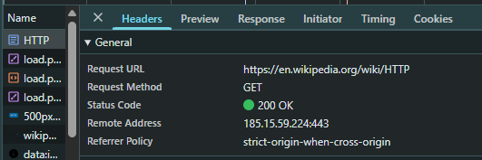
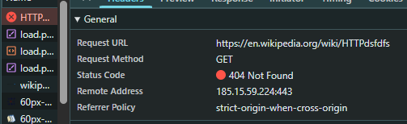
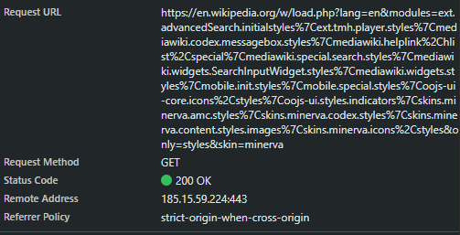

#  Лабороторная работа №1 РНР #

## Задание 1. Анализ HTTP-запросов. ##

### URL запроса
https://en.wikipedia.org/wiki/HTTP

### Метод запроса
GET

### Почему используется метод GET
Метод **GET** используется для получения данных с сервера.  
При загрузке веб-страницы браузер запрашивает HTML-документ, не изменяя данные на сервере, поэтому применяется именно GET.

---

### Статус ответа
200 OK

### Значение статуса
Статус **200 OK** означает, что запрос был успешно обработан сервером и запрашиваемая страница была найдена и возвращена клиенту.

---

## Заголовки запроса и ответа

### Заголовки запроса (Request Headers)

| Заголовок | Назначение |
|----------|------------|
| Host | Указывает домен сервера |
| User-Agent | Информация о браузере и ОС |
| Accept | Типы данных, которые может принять клиент |
| Accept-Language | Предпочтительный язык |
| Accept-Encoding | Поддерживаемые методы сжатия |
| Connection | Тип соединения (keep-alive) |

---

### Заголовки ответа (Response Headers)

| Заголовок | Назначение |
|----------|------------|
| Content-Type | Тип возвращаемых данных (text/html) |
| Content-Encoding | Метод сжатия |
| Cache-Control | Правила кэширования |
| Last-Modified | Дата последнего изменения |
| ETag | Идентификатор версии ресурса |
| Server | Информация о сервере |

---

## Тело запроса и ответа

### Тело запроса
Тело запроса **отсутствует**, так как используется GET-запрос.

### Тело ответа
Тело ответа **присутствует** и содержит HTML-код страницы Wikipedia, который отображается в браузере.

---

## Дополнительные запросы при загрузке страницы

При загрузке страницы браузер отправляет дополнительные запросы:

- CSS-файлы — для оформления страницы
- JavaScript-файлы — для интерактивности
- Изображения — логотипы и иконки
- Шрифты и служебные ресурсы

Эти запросы необходимы для корректного отображения страницы.

---

### URL
https://en.wikipedia.org/wiki/HTTPdsfdfs

### Метод запроса
GET

### Статус ответа
404 Not Found

### Причина ошибки
Статус **404 Not Found** означает, что запрашиваемая страница не существует на сервере.  
Wikipedia не имеет ресурса с таким адресом, поэтому сервер возвращает ошибку.

---

# Задание 2. Анализ HTTP-запросов.

## Поиск на странице Wikipedia

### Страница поиска
https://en.wikipedia.org/wiki/Special:Search

В строке поиска было введено слово:
url

---

## Найденный запрос в Network

### URL запроса
https://en.wikipedia.org/w/index.php

Данный URL используется для обработки поисковых запросов на Wikipedia.

---

### Метод запроса
GET

#### Почему используется GET
Метод **GET** применяется, так как поиск:
- не изменяет данные на сервере;
- передаёт параметры через URL;
- позволяет сохранять и повторять поисковый запрос.

---

## Query Parameters (параметры запроса)

Пример параметров:

| Параметр | Значение | Назначение |
|--------|----------|------------|
| search | url | Поисковый запрос |
| title | Special:Search | Служебная страница поиска |
| fulltext | 1 | Выполнить полный поиск |
| ns0 | 1 | Поиск в основном пространстве статей |

---

## Тело запроса и ответа

- **Тело запроса:** отсутствует (используется GET)
- **Тело ответа:** HTML-страница с результатами поиска

---

---

# Задание 3. Анализ HTTP-запроса сайта YouTube

### URL запроса
https://www.youtube.com/

---

### Метод запроса
GET

**Причина использования GET:**  
Метод GET применяется для получения веб-страницы без изменения данных на сервере.  
Он используется браузером по умолчанию при загрузке сайтов.

---

### Статус ответа
200 OK

**Значение:**  
Запрос был успешно обработан, и главная страница YouTube загружена.  
(Возможен предварительный редирект 301/302, затем 200 OK.)

---

##  Заголовки запроса и ответа

### Заголовки запроса 
- Host
- User-Agent
- Accept
- Accept-Language
- Accept-Encoding
- Connection

### Заголовки ответа 
- Content-Type
- Cache-Control
- Set-Cookie
- Content-Encoding
- Server

---

## Тело запроса и ответа
- **Тело запроса:** отсутствует (GET-запрос)
- **Тело ответа:** HTML-код главной страницы YouTube

---

## Дополнительные запросы
После загрузки HTML браузер отправляет дополнительные запросы:
- JavaScript-файлы
- CSS-стили
- JSON-запросы к API
- Изображения и иконки

Эти запросы необходимы для динамической работы сайта.

---

# Задание 4. Составление HTTP-запросов

## GET-запрос с User-Agent

GET / HTTP/1.1

Host: sandbox.usm.com

User-Agent: Bolgari Ivan

User-Agent — заголовок HTTP, передающий серверу 
информацию о клиенте.
Используется для идентификации и анализа запросов.

### POST-запрос (создание автомобиля)
POST /cars HTTP/1.1

Host: sandbox.usm.com

Content-Type: application/x-www-form-urlencoded

make=Honda&model=Civic&year=2020

POST применяется для создания новых ресурсов.

### Основные HTTP-методы
- Метод	Назначение
- GET	Получение данных
- POST	Создание ресурса
- PUT	Полное обновление
- PATCH	Частичное обновление
- DELETE	Удаление ресурса
### PUT-запрос (обновление автомобиля)
PUT /cars/1 HTTP/1.1

Host: sandbox.usm.com

User-Agent: Bolgari Ivan

Content-Type: application/json

{
  "make": "Honda",
  "model": "Civic",
  "year": 2021
}
### PUT vs PATCH
PUT — обновляет ресурс полностью

PATCH — обновляет часть ресурса

## Пример ответа сервера и коды
HTTP/1.1 201 Created

- Код	Значение
- 200	Успех
- 201	Создано
- 400	Ошибка запроса
- 401	Не авторизован
- 403	Запрещено
- 404	Не найдено
- 500	Ошибка сервера
